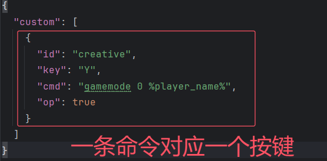
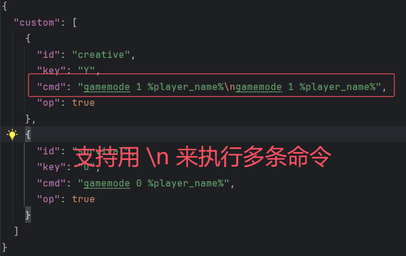

# CmdKey——简单的宏按键

## 1.使用方法
- 启动一次，生成cmdkey.cfg，填入密钥，可以定义密钥
- 密钥正确后在服务端config文件夹下面会生成cmdkey/cmd.json
## 2.自定义

``自定义命令按键``

``多条指令支持``

## 3.变量支持

| 变量               | 对应      |
|------------------|---------|
| player_name      | 玩家名     |
| player_pos_x     | 玩家X坐标   |
| player_pos_y     | 玩家Y坐标   |
| player_pos_z     | 玩家Z坐标   |
| player_pos       | 玩家坐标    |
| player_health    | 玩家血量    |
| player_food      | 玩家饥饿值   |
| player_exp       | 玩家经验    |
| player_level     | 玩家等级    |
| player_dimension | 玩家所在维度  |
| player_x_rot     | 玩家头水平角度 |
| player_y_rot     | 玩家俯仰角度  |
| player_uuid      | 玩家UUID  |

## 4.仍需改进
- 添加更多变量
- 支持延迟、循环命令
- 支持权限
- 支持多个按键同时处理

## 5.吐槽
`1.6.4用的最难受，再也不想碰了`
`网络通信太原始了`
## 6.感谢
- [Tapio](https://github.com/MikhailTapio)感谢提供了1.6.4的环境